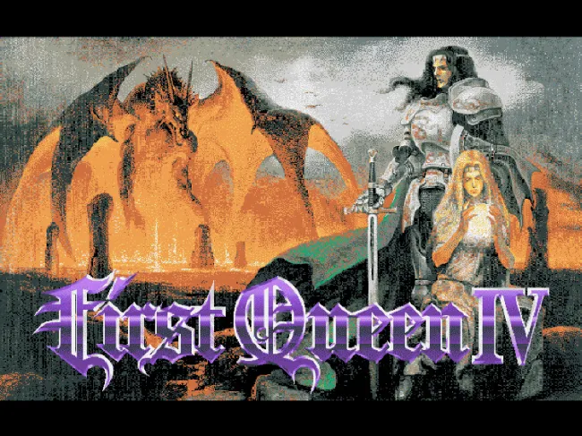
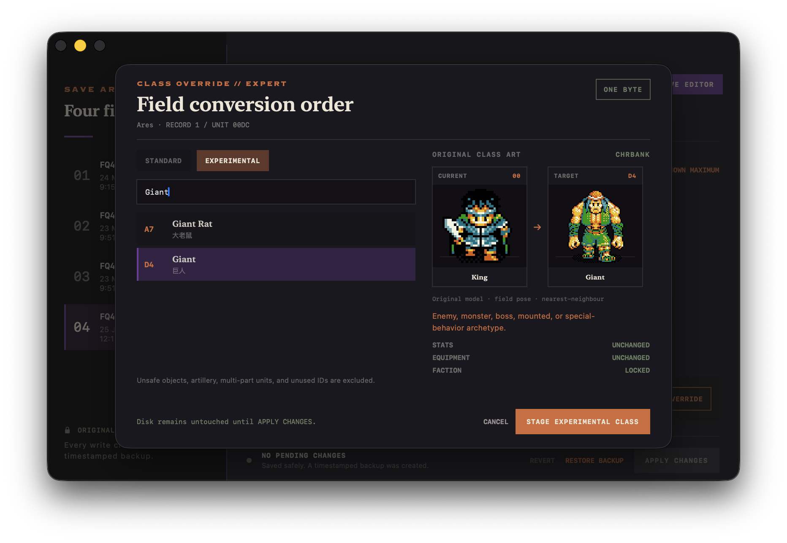

# FQ4 Wrapper for macOS

A native macOS home for a user-supplied DOS copy of *First Queen IV*: one-click
launching through DOSBox Staging, four-slot save management, and a class-aware
editor built around the game's original data and pixel art.

This is a non-commercial fan project. The original game and DOSBox are external
dependencies and are **not included in this repository**.

## Class-aware save editor



The editor reads the original `CHRBANK` graphics and `MAIN.EXE` class table so a
class change can be inspected before it is staged. Standard roles are separated
from experimental enemy and boss archetypes, unsafe object and multi-part IDs
are excluded, and a class override changes only the character's class byte.

## Highlights

- Launches the original `PLAY.BAT` through DOSBox Staging at a fixed 25,000 CPU
  cycles for smoother animation.
- Uses a native SwiftUI launch screen based on the original cover artwork.
- Manages all four `FQ4GD.0`–`FQ4GD.3` save slots.
- Edits gold, inventory quantities, character attributes, and mapped character
  names.
- Previews current and target class sprites using the original game artwork.
- Refreshes the selected save from disk without reopening the app.
- Creates a timestamped backup before every save-file write.
- Locks save editing while DOSBox is running.

## What you need

- macOS 13 Ventura or later.
- Xcode Command Line Tools, including Swift 6.
- [DOSBox Staging](https://www.dosbox-staging.org/) installed as
  `/Applications/DOSBox Staging.app`.
- A legally owned DOS copy of *First Queen IV*.

The project deliberately ignores `FQ4/`, DOSBox app bundles, local save files,
and packaged builds. Keep those files local and do not add them to source
control.

## Add your game files

Create `FQ4/` at the repository root and copy your original DOS game files into
it. At minimum, the build and editor expect the original launch executable and
data archives, including:

```text
fq4-remake/
└── FQ4/
    ├── PLAY.BAT
    ├── MAIN.EXE
    ├── CHRBANK
    └── ...
```

`FQ4/` is ignored by Git. It is copied only into your local app bundle during
the build.

## Build the app

If the command-line developer tools are not already installed:

```sh
xcode-select --install
```

From the repository root, run:

```sh
./scripts/build-app.sh
```

The script runs the Swift test suite, creates a release build, adds your local
game files and cover art, generates the app icon, applies an ad-hoc signature,
and verifies the finished bundle:

```text
build/FQ4 Wrapper.app
```

Launch the local build:

```sh
open "build/FQ4 Wrapper.app"
```

Or install it in `/Applications`:

```sh
ditto "build/FQ4 Wrapper.app" "/Applications/FQ4 Wrapper.app"
```

On first launch, the wrapper creates a writable game copy under:

```text
~/Library/Application Support/FQ4 Wrapper/FQ4
```

This keeps runtime writes and edited saves away from the original files used to
build the app.

## Development

Run the tests without packaging the app:

```sh
swift test
```

The project is a Swift Package with a native SwiftUI executable target and
requires no third-party Swift dependencies.

## Project boundary

This repository contains only the wrapper source, tests, documentation, and
project artwork. It does not provide the original *First Queen IV* game files or
the DOSBox emulator. Do not distribute a locally built app containing
proprietary game assets without permission from the relevant rights holders.
The launcher does not modify or bypass the original executable; the optional
editor writes only to the user's private save copy after creating a backup.

## License

The wrapper source code and original project documentation are open source
under the [MIT License](LICENSE).

The original game, cover, in-game sprites, names, trademarks, and other
third-party material are not relicensed. See
[Third-party assets](THIRD_PARTY_ASSETS.md) for the exact boundary.
